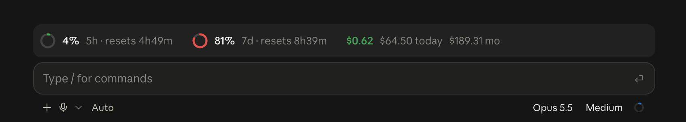

# burn

A [Claude Code mod](https://code.claude.com/docs/en/plugins/mods/overview) that shows your context, rate limits, usage credits and spend above the prompt.

In the Desktop app:



In the terminal:

```
 Opus 5.5 › Explore   ◔ 31% ctx 62k/200k   ◑ 59% 5h ↻7m   ◕ 81% 7d ↻8h57m   ● €120.06/120   ≈$3.27 session
```

- **Band above the prompt**: the model and any subagents running under it, context window fill, 5 hour and weekly limit usage with a reset countdown, your usage credits for the month, and this session's cost. Skills loaded this session get a row of their own below it. The Desktop app draws the rings as SVG, the terminal as glyphs.
- **`/burn`**: opens a pane with what fills the context (as `/context` counts it), the limits, credits, a bar chart of the last 7 days and the totals. **Compact** (`c`) compacts the session, **Refresh** (`r`) reloads the figures, and `/burn refresh` does the same from the prompt.
- **Context warning**: a toast once the context passes 85%, suggesting `/compact`.

## Install

Requires Claude Code v2.1.287 or later.

```
/plugin marketplace add PickleBoxer/claude-plugins
/plugin install burn@pickleboxer
```

## Where the numbers come from

- **Context, rate limits and session cost** come from Claude Code itself. The context breakdown is estimated locally, so it costs no request. Limits show after the first request, and only on a Pro or Max subscription.
- **Usage credits** are the only billed figure. They come from the same endpoint `/status` reads, through Claude Code's own credential, which the mod never sees. That endpoint is internal, so if it changes the credits group just disappears.
- **Today, 7 day and month (≈)** are API-equivalent cost, not your bill. burn records each session's cost per day on this machine, starting when you install it, so the chart fills in over the first week.

## Configuration

`terminalIcons` picks the terminal's icons: `pie` (default) draws fill glyphs that work in any font, `nerd` draws [Nerd Font](https://www.nerdfonts.com) icons for context, the clock, the calendar and your currency. Change it in `/config`, or in `~/.claude/settings.json`:

```json
{
  "pluginConfigs": {
    "burn@pickleboxer": { "terminalIcons": "nerd" }
  }
}
```

## Development

```
claude --plugin-dir .          # loads the mod and reloads it on save
claude plugin validate .claude-plugin/plugin.json
claude plugin test .
```

## License

MIT
